# 1- Removing the background of an image:
## Input:

## Output:

# 2- Color recognation:
## Outputs:

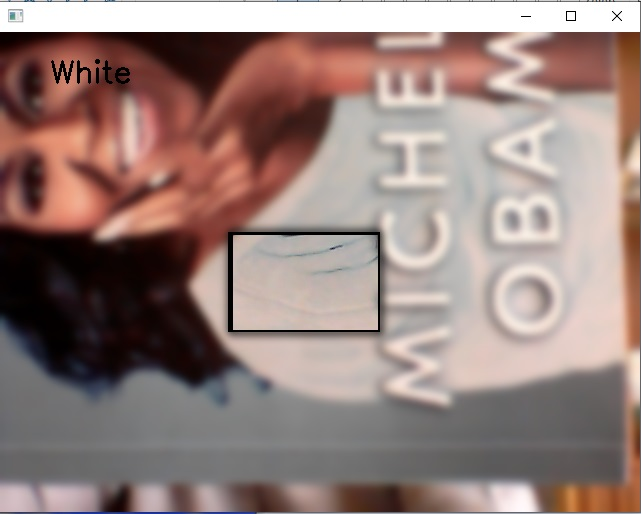

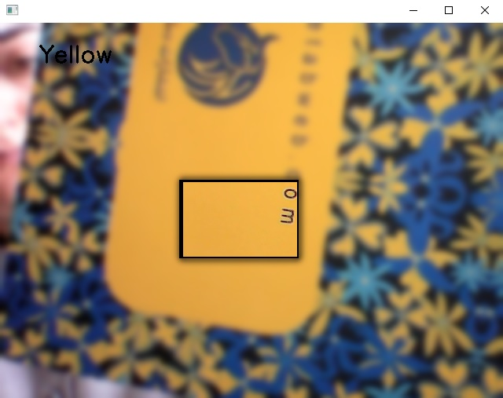

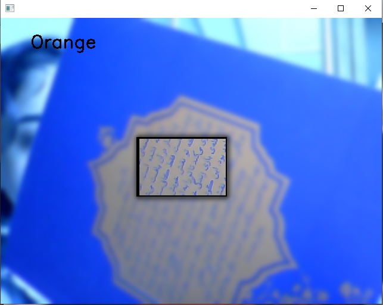

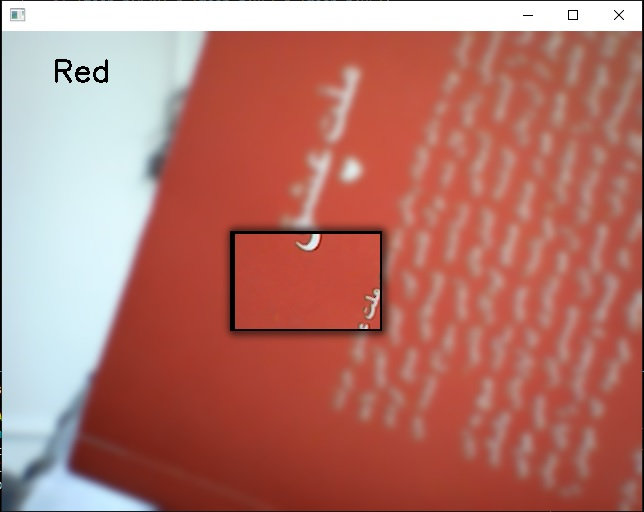

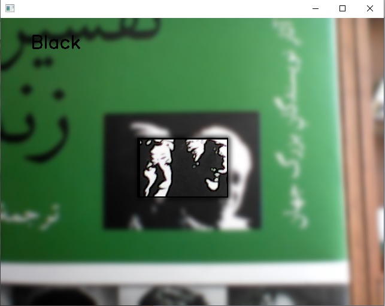

# 3- Pose landmarks:
## Input:

## Output:
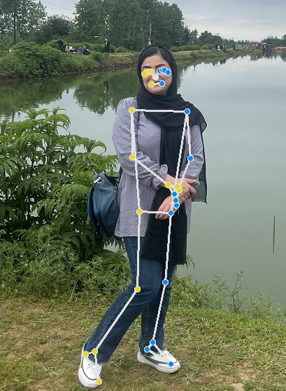

# 4- Using of pillow library for writing a persian text on an image and calculating its histogram:
## Input:

## Outputs:

### 1- Histogram of original image(Input):
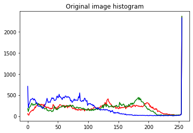

### 2- The image with persian text:
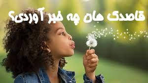

### 3- Equalized image and its hisogram plot:
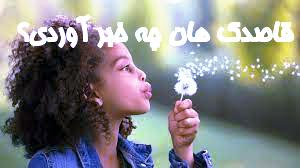

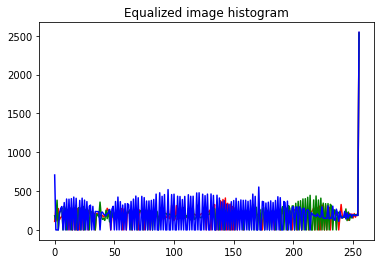

### 4- Gray image and its hisogram plot:
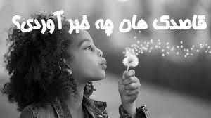

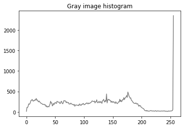

### 5- Equalized gray image and its hisogram plot:
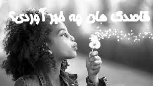

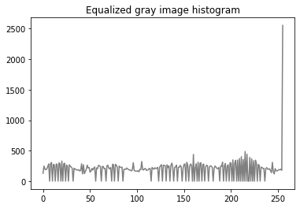