# 1- Calculate the histogram of an image and shoe on diagram.

## Input:

## Outputs:

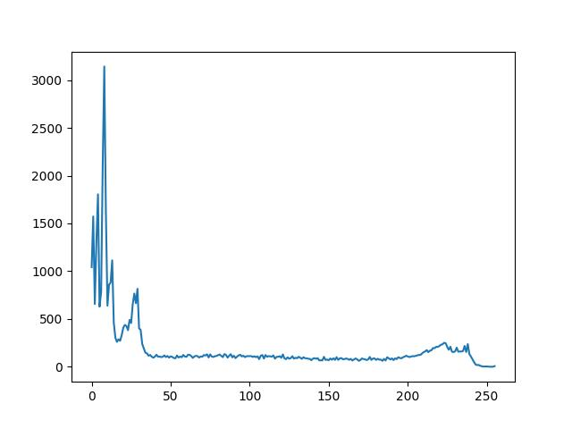

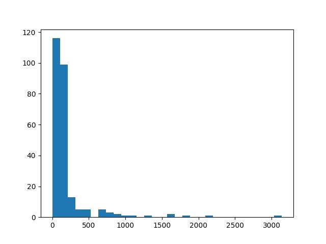

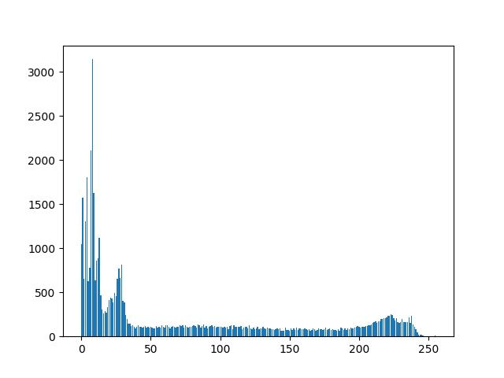

# 3- Edge Detection

## Input:

## Output:
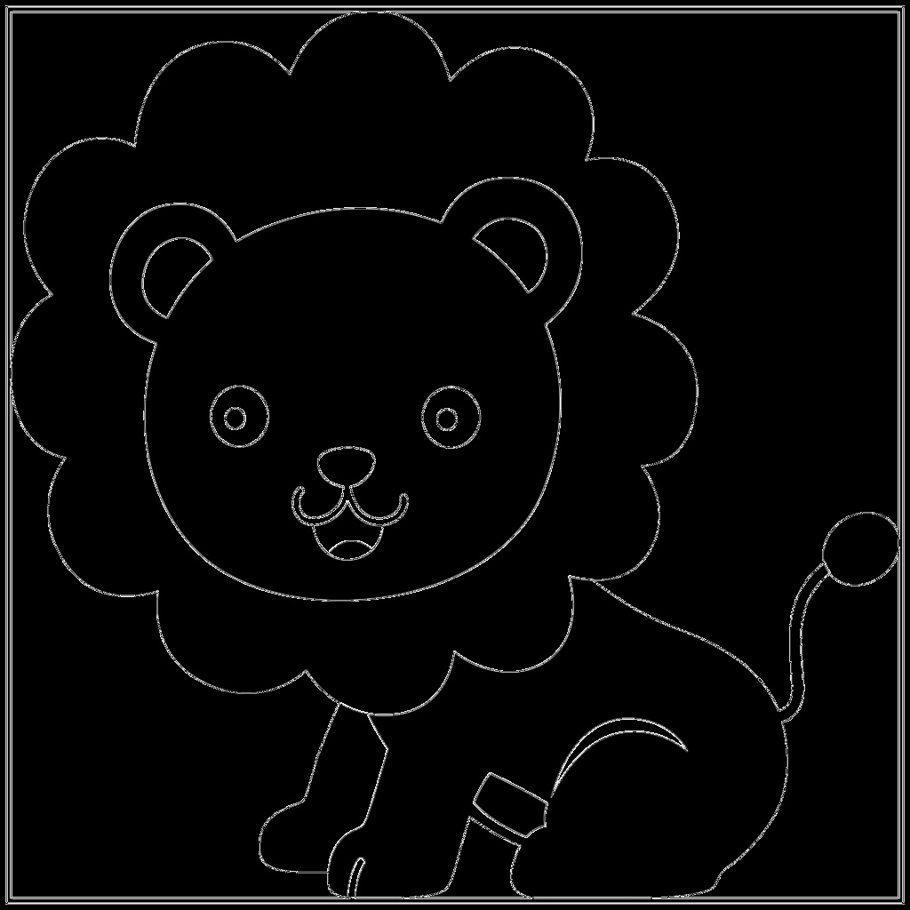

----------------------------

## Input:

## Output:

# 4- Horizontal and Vertical Edge Detection

## Input:
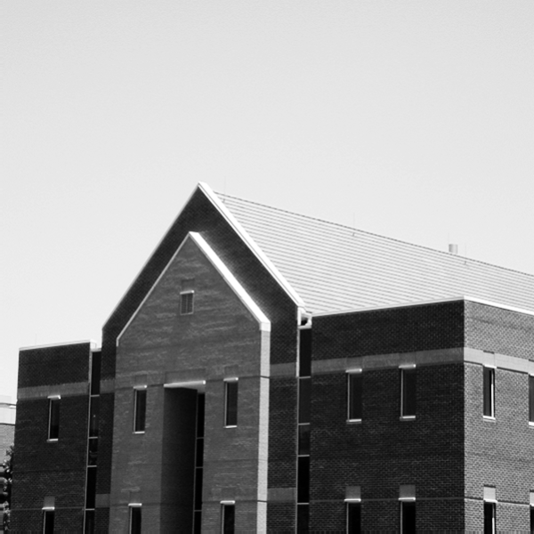

## Outputs:
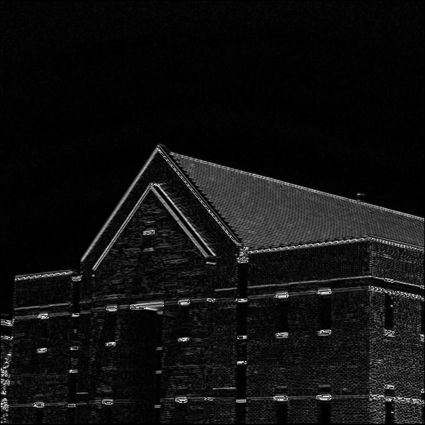

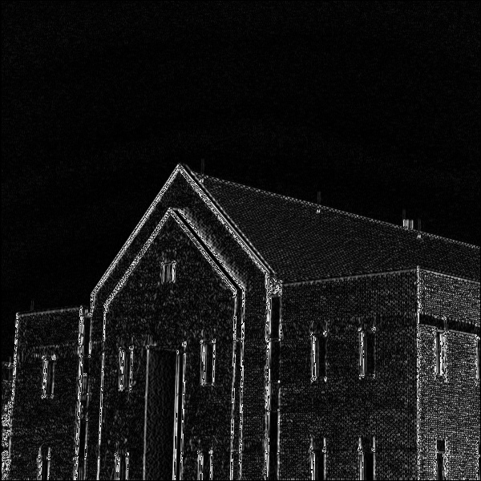

# 5- Noise reduction

## Input:

## Outputs:
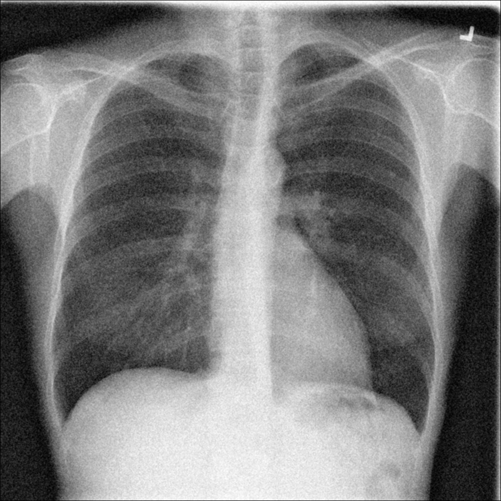

## Input:

## Outputs:
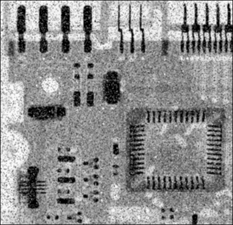

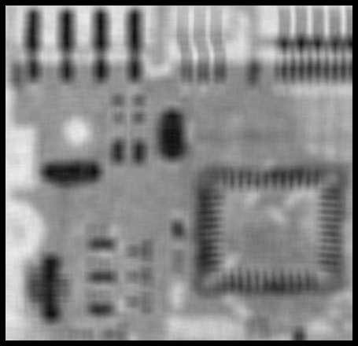

## Input:

## Outputs:
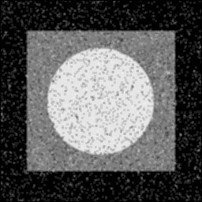

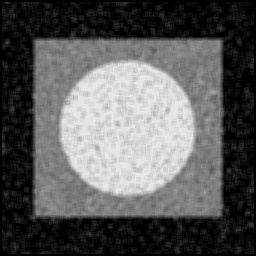

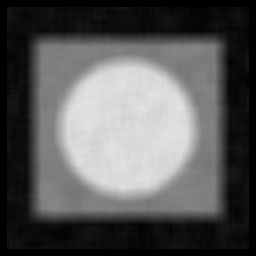