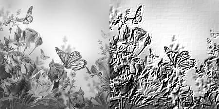
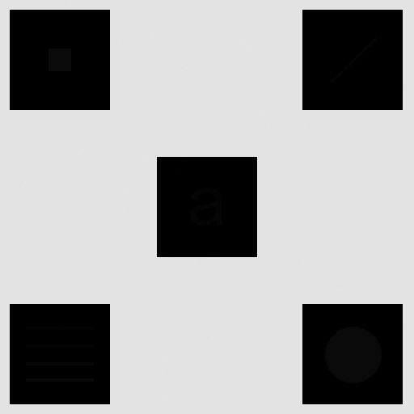
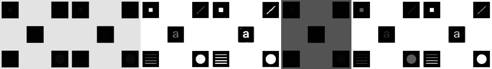
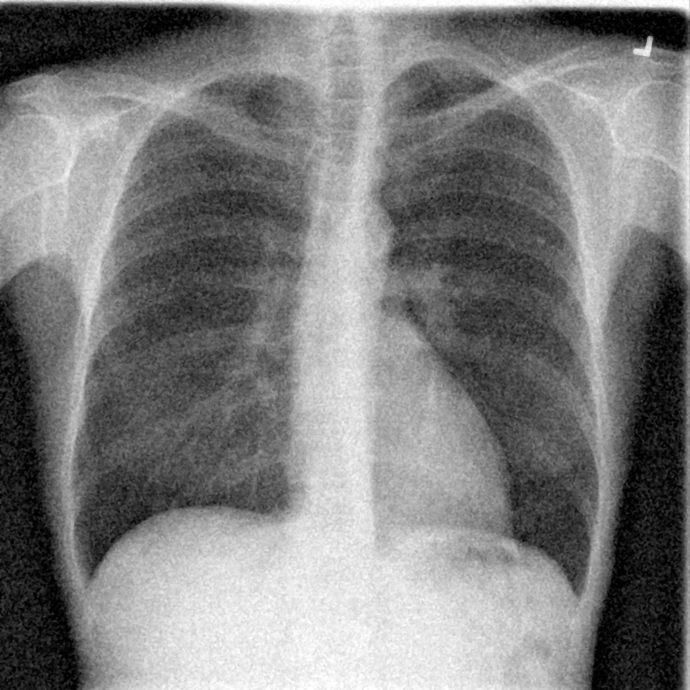
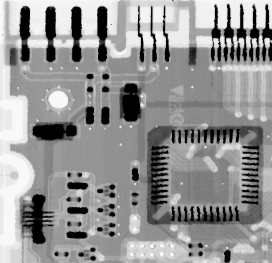
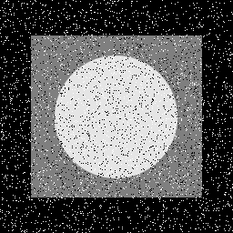
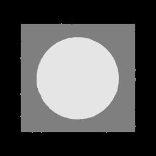
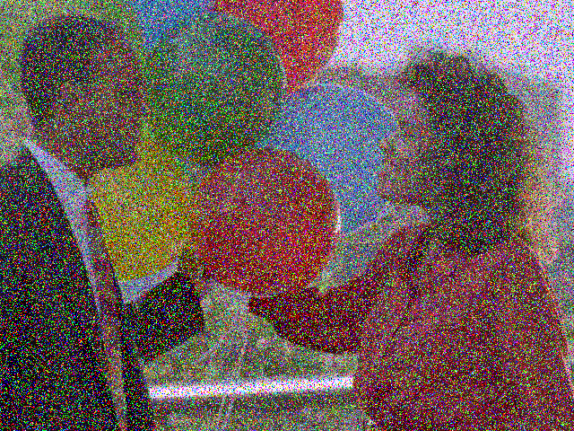
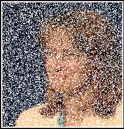
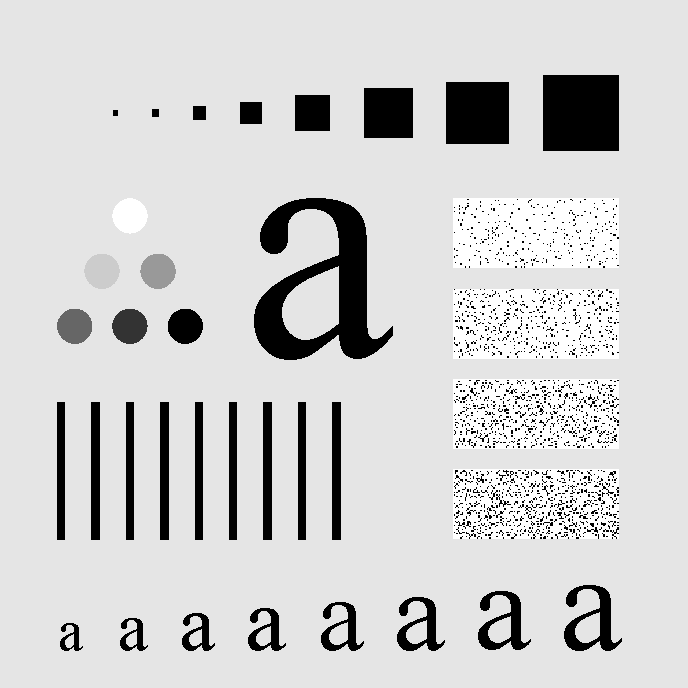

# 1- 2Dfilter

## Input:

## Outputs:

### 1- Edge Detection:

### 2- Sharpening:

### 3- Emboss:

### 4- Identity:

### 5- My filter:

# 2- The Average Filter

## Input:

## Outputs:

# 3- The Median Filter

## Input:

## Output:

----------------------------

## Input:

## Output:

-----------------------

## Input:

## Output:

--------------------------------

## Input:

## Output:

---------------------------------------

## Input:

## Output:

---------------------------------

## Input:

## Output:

