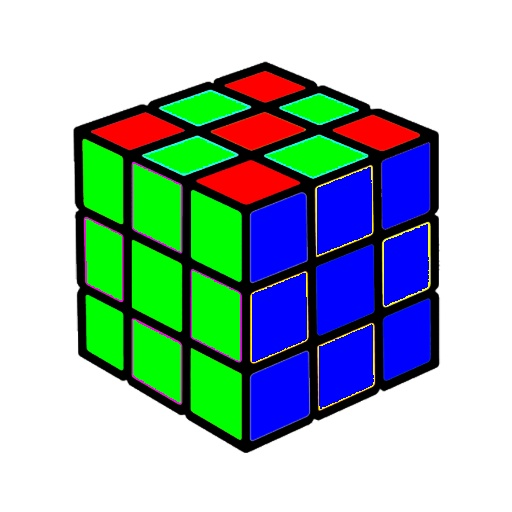

# 1- Writing a function to change a BGR image to grayscale image
## Input:

## Output:

# 2- Drawing a rainbow
## Output:

# 3- Convert a watermelon image to materwelon image
## Input:

## Output:

# 4- Solving the Rubik

## Output:

# 5- Drawing the Microsoft logo
## Output:

