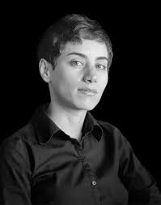

# 1- Face Morphing

# 2- Black Hole

# 3- Sketched Photo
Before:

After:

# 4- Secret text
## The first picture:

## The second picture:

## Result:

# 5- Background Estimation

# 6- Virtual Decoration

## Using these 3 images:

### 1- Room image:

### 2- Floor image:

### 3- Mask image:

I floored the room as you can see below:

