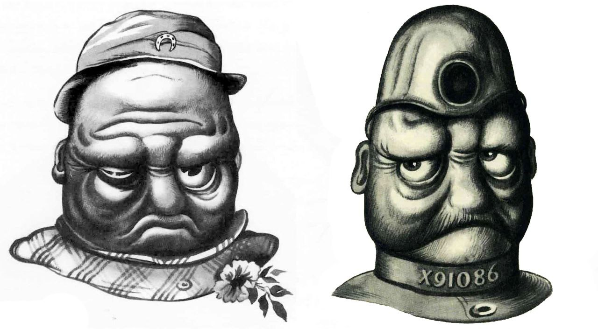
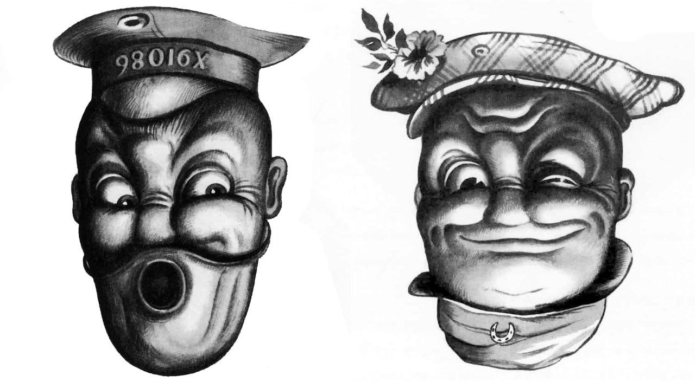
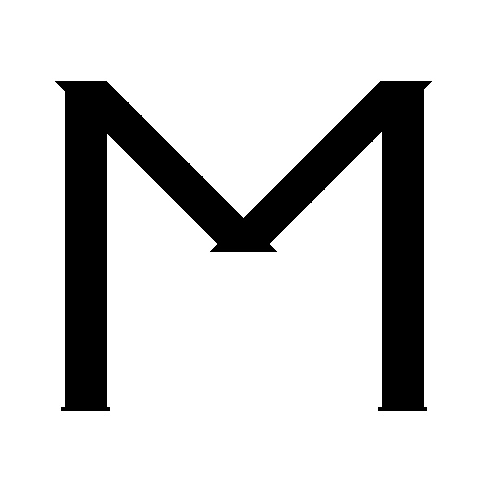

# Python-OpenCV
OpenCV for Python

--------------------------------------

# Image Proccenig using OpenCV

-----------------------------

## 1- Chess board 

## 2- Invert light and dark colors

### The Woman Picture
Before:

After:

### The Man Picture
Before:

After:

## 3- Rotate 180 degree
Before:

After:

## 4- Letter "M"

## 5- Gradient

## 6- Adding a diagonal black tape to a picture

Before:

After:

