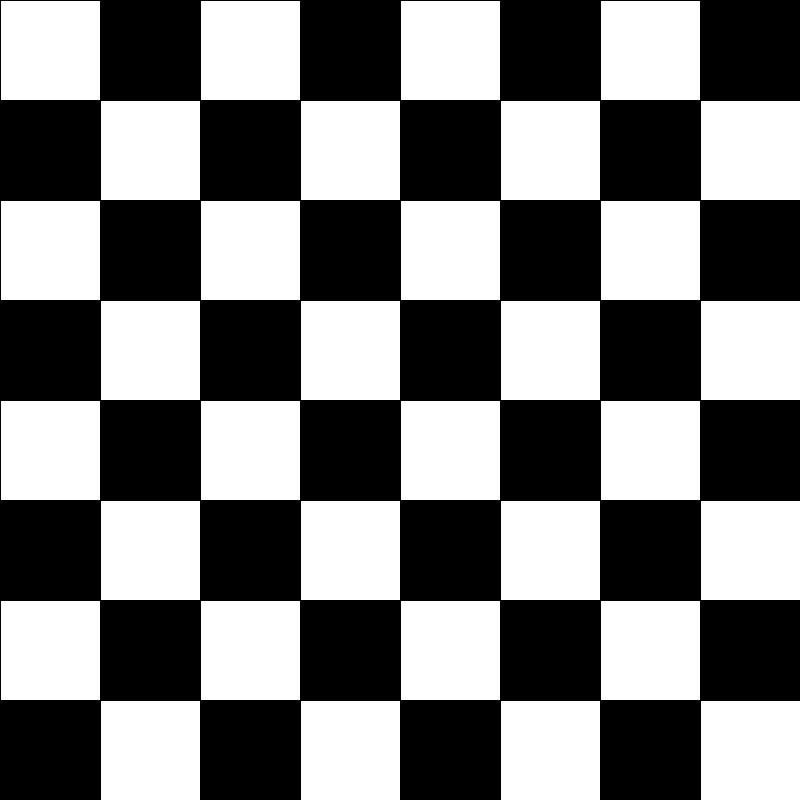
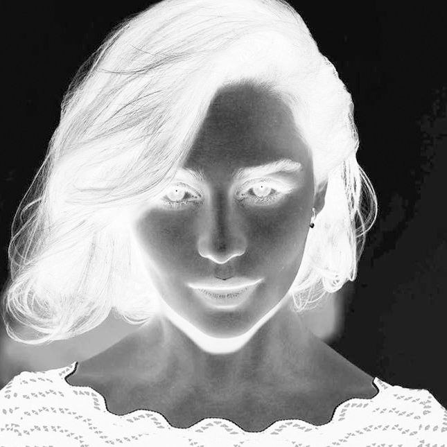
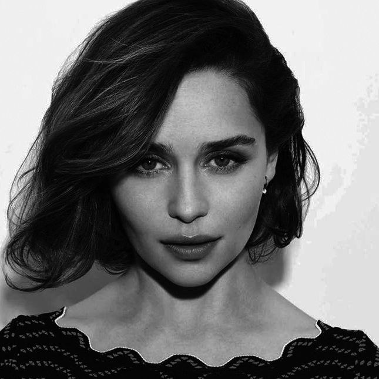
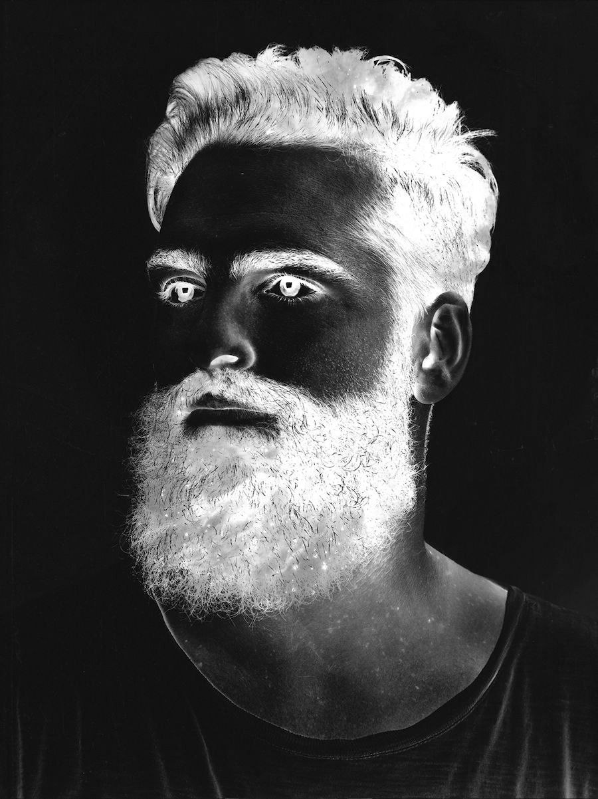
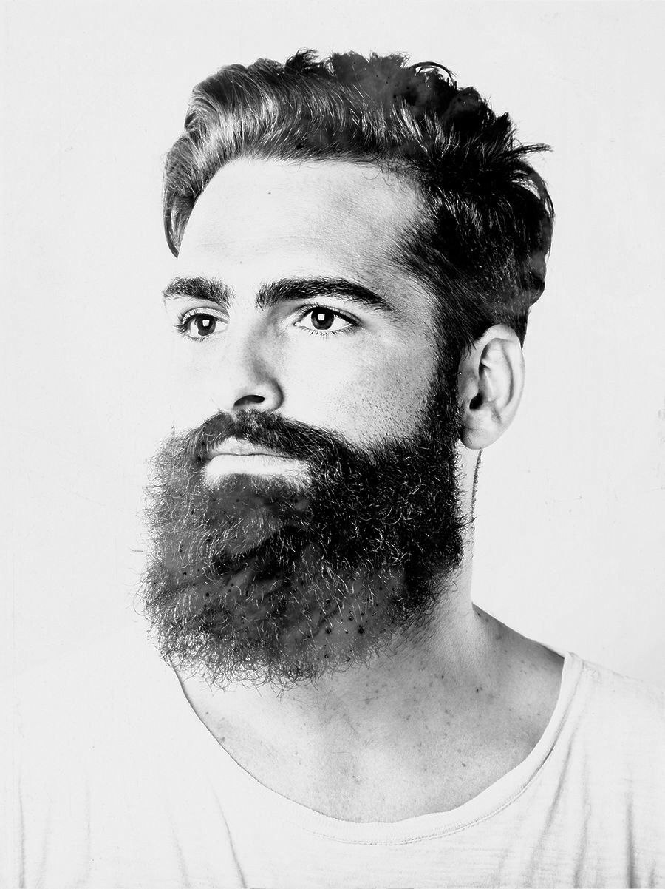
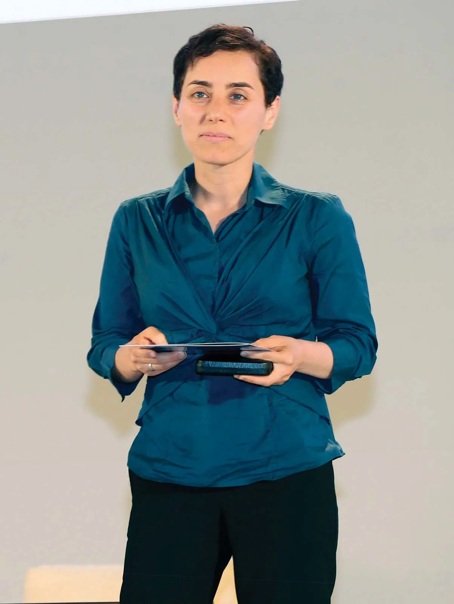
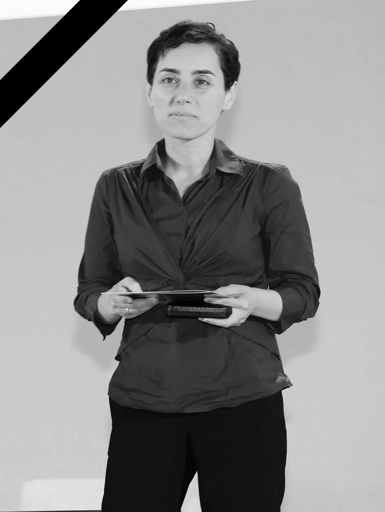

# Python-OpenCV
OpenCV for Python

--------------------------------------

# Image Proccenig using OpenCV

-----------------------------

## 1- Chess board 

## 2- Invert light and dark colors

### The Woman Picture
before:

after:

### The Man Picture
before:

after:

## 3- Rotate 180 degree

## 4- Letter "M"

## 5- Gradient

## 6- Adding a diagonal black tape to a picture

Before:

After:

